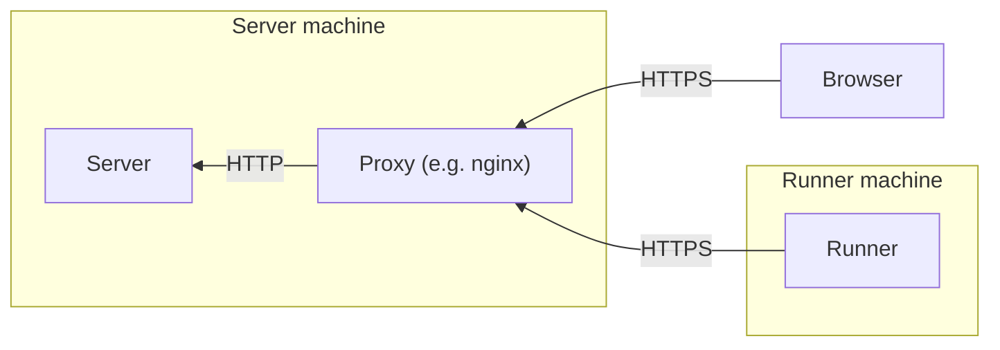

# Radar

*"Do you know how fast you were going?"*

## Architecture

Radar consists of a *server* and one or more *runners*.
The server coordinates the runners, stores the benchmark results, and serves a web ui.
The runners perform the benchmarks
and should run on dedicated machines if interference by other processes could pose a problem.
The server serves the web ui over HTTP,
as well as an API that is used by both the web ui and the runners.

## Concepts

The server fetches updates to the configured repos and bench repos every few minutes.
When new commits on a repo's main branch are detected, they are added to the queue.
Runners then execute the configured bench scripts and report their results to the server.
Finally, users view and analyze the results using the web ui.

- **Server:**
  An instance of the radar server program running on some machine.
  It is configured using a config file and command-line options.
  The server coordinates runners, stores the benchmark data, and serves it to users using a web ui.
- **Runner:**
  An instance of the radar runner program running on some machine.
  It executes bench scripts.
- **Repo:**
  A git repository tracked by radar.
- **Bench repo:**
  Each repo has an associated bench repo, which is also a git repository.
  The bench repo contains one or more bench scripts, as well as other arbitrary files.
- **Bench script:**
  A bench script is executed on a runner to produce measurements.
  The bench script specification defines how a bench script must behave.
- **Metric:**
  A metric defines one kind of measurement that can be collected for a commit.
  It consists of a unique name and a unit, both arbitrary strings.
  By convention, the metric consists of two parts separated by `//`,
  confusingly called "Metric" and "Submetric" by the UI.
  The first part can be hierarchical with `/` as a separator, also just by convention.
  Some units have special support by radar (see the bench script specification).
- **Run schema:**
  A run schema describes how to execute a run for a commit.
  It consists of a name, a bench script, and a runner that should execute the bench script.
  This means that each runner has a specific set of tasks that are not shared by the other runners.
  Each repo has one or more run schemata with unique names, configured in the config file.
  Different repos may have different run schemata.
- **Run:**
  A run is the result of executing a run schema for a specific repo and bench repo commit.
  It contains a set of measurements produced by the bench script
  as well as additional information about the execution such as logs, run time, and exit code.
- **Measurement:**
  A measurement is a value associated with a commit and a specific metric.
- **Queue:**
  When the server detects new commits in a repo's main branch, they are added to the queue.
  Runners then execute the run schemata of all commits in the queue
  and send the resulting runs to the server.
  Once all of a commit's run schemata have been executed, the commit is removed from the queue.
- **GitHub Bot:**
  If the server is provided with a GitHub token,
  it can scan pull request comments for calls to the `!bench` or `!radar` commands
  and reply with benchmark results for the PR's latest commit.

## Bench repo specification

A bench repo is a git repository.
It contains one or more *bench scripts* at arbitrary paths inside the repo.
Each bench script must be executable as a command
(i.e. have the executable bit set and either have a shebang or be a binary).

When the runner executes a bench script, it first clones the repo and the bench repo to arbitrary locations.
The clones may be shallow clones.
It then executes the bench script with its working directory set to the root of the bench repo.
The bench script receives two arguments:

1. An absolute path to the clone of the repo.
2. An absolute path to the output file, which does not yet exist.

While the bench script is running, its stdout and stderr are captured by the runner.
Its exit code is recorded as well.
When it is 0, the run is considered successful
while a nonzero exit code indicates that an error occurs.
Regardless of the exit code, after the bench script exits,
the runner attempts to read the output file at the path passed to the bench script.

The output file follows the [JSON Lines](https://jsonlines.org/) format
containing one row for each measurement.
Each row is a JSON object with the following fields:

- `metric`: The name of the metric (a string).
- `value`: The measured value (a floating point number).
- `unit` (optional): The value's unit (a string).
  Some units have special support by radar.
- `direction` (optional):
  -1 if a decrease in value is a good thing,
  1 if an increase in value is a good thing,
  0 if values have no direction.
  **Warning:** This option is going to be moved into the config file at some point in the future.

Unit names are case-sensitive.
The units with special support are:

- `s`: Seconds
- `B`: Bytes
- `%`: Percentage (a value of 50 corresponds to 50%)
- `100%`: Fractional percentage (a value of 0.5 corresponds to 50%)

## Opening the repo in IntelliJ IDEA

1. Delete the contents of the `.idea` directory
2. Open the project with IntelliJ
3. Accept the "maven project detected" popup
4. Close IntelliJ
5. Checkout the `.idea` directory using git

Opening the repo directly doesn't seem to work reliably, at least not on my machine.
